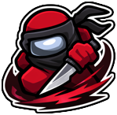
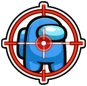
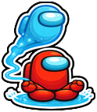
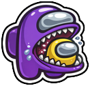

  
  
Super Squad Among Us

 

A client-side [Among Us](https://store.steampowered.com/app/945360/Among_Us) addon mod that adds new
custom roles to [Town of Us: Mira](https://github.com/AU-Avengers/TOU-Mira), built on top of
[MiraAPI](https://github.com/All-Of-Us-Mods/MiraAPI).

-----------------------

> [!TIP]
> Check out this addon's [**wiki**](wiki/Home.md) for a full breakdown of every role's abilities and
> default options!

-----------------------

# Contents

- [**Contents**](#contents)
- [**Roles**](#roles)
- [**Building**](#building)
- [**Credits**](#credits)
- [**License**](#license)
- [**Copyright**](#copyright)

-----------------------

# Roles

Super Squad Among Us adds **13 custom roles** across Crewmate, Impostor, and Neutral. See the
[**wiki**](wiki/Home.md) for each role's full ability breakdown and configurable options.

  <b>Crewmate</b> 
  
  

  <b>Impostor</b> 
  
  
  
  
  
  
  
  

  <b>Neutral</b> 
  
  
  

-----------------------

# Building

See [CLAUDE.md](./CLAUDE.md) for build instructions and architecture notes. This addon depends on the
compiled MiraAPI + TownOfUsMira packages — it is not a fork of TOU-Mira and never edits its source.

-----------------------

# Credits

- [Town of Us: Mira](https://github.com/AU-Avengers/TOU-Mira) (AU-Avengers) and
  [MiraAPI](https://github.com/All-Of-Us-Mods/MiraAPI) (All-Of-Us-Mods) — the frameworks this addon
  is built on.
- [AllTheRoles](https://github.com/Zeo666/AllTheRoles) (Zeo666 and contributors) — the **Astral,
  Sniper, and Pelican** role designs and their button art originate from AllTheRoles and were
  ported to this addon re-implemented on MiraAPI/TOU-Mira.
- [TheOtherRoles](https://github.com/TheOtherRolesAU/TheOtherRoles) (GPL-3.0, the mod AllTheRoles
  descends from) — the **Ninja, Witch, Godfather, Mafioso, Mafia Janitor, Eraser, and Vulture**
  role designs, their button art, and the trace/spell/arrow sprites come from TheOtherRoles.

-----------------------

# License
This software is distributed under the GNU GPLv3 License. BepInEx is distributed under the LGPL-2.1 License.

# Copyright

This mod is not affiliated with Among Us or Innersloth LLC, and the content contained therein is not endorsed or otherwise sponsored by Innersloth LLC. Portions of the materials contained herein are property of Innersloth LLC.

© Innersloth LLC.

