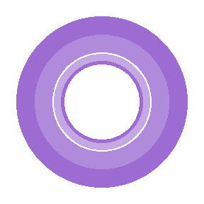
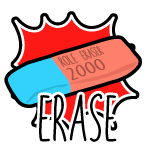
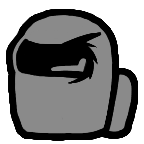
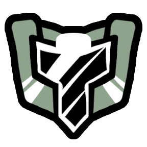

# Super Squad Among Us Wiki

Super Squad Among Us is a client-side addon for [Town of Us: Mira](https://github.com/AU-Avengers/TOU-Mira)
(built on [MiraAPI](https://github.com/All-Of-Us-Mods/MiraAPI)) that adds new custom roles to the game.
This wiki covers every role the addon currently adds, what it does, its abilities, and its
configurable lobby options.

For build/install instructions, see the [root README](../README.md).

-----------------------

## Roles

### Crewmate

| | Role | Alignment | Summary |
|---|---|---|---|
|  | [Apparater](roles/Apparater.md) | Power | Teleport to places around the map. |
|  | [Daddy Hagrid](roles/DaddyHagrid.md) | Protective | Hide players in your cloak to keep them safe. |
|  | [Elusive](roles/Elusive.md) | Protective | Send your attackers somewhere far, far away. |
|  | [Invisible Boy](roles/InvisibleBoy.md) | Support | Turn invisible when no one is watching. |

### Impostor

| | Role | Alignment | Summary |
|---|---|---|---|
|  | [Godfather](roles/Godfather.md) | Killing | Kill all Crewmates. |
|  | [Mafioso](roles/Mafioso.md) | Killing | Work with the Mafia to kill the Crewmates. |
|  | [Mafia Janitor](roles/MafiaJanitor.md) | Support | Work with the Mafia by hiding dead bodies. |
|  | [Ninja](roles/Ninja.md) | Killing | Surprise and assassinate your foes. |
|  | [Sniper](roles/Sniper.md) | Killing | Shoot the crew with your sniper. |
|  | [Astral](roles/Astral.md) | Concealing | Pass through walls with ease. |
|  | [Eraser](roles/Eraser.md) | Support | Mark players and strip them of their role — immediately or at the next meeting. |
|  | [Witch](roles/Witch.md) | Support | Cast a hex upon your foes. |

### Neutral

| | Role | Alignment | Summary |
|---|---|---|---|
|  | [Pelican](roles/Pelican.md) | Killing | You're soooo hungry. |
|  | [Sentinel](roles/Sentinel.md) | Killing | Eliminate those who stand in your path. |
|  | [Vulture](roles/Vulture.md) | Evil | Eat corpses to win. |

-----------------------

## Modifiers

Universal modifiers can be assigned to any role on top of it. They ship with their **Amount** option
at `0` — turn it up in the Modifiers settings tab to enable them.

| Modifier | Summary |
|---|---|
| [Invisibility Cloak](modifiers/InvisibilityCloak.md) | Throw on your cloak to turn invisible for a short while. |
| [Slide Tackle](modifiers/SlideTackle.md) | Slide tackle the nearest player, stunning them briefly. |

-----------------------

## Origins

Several roles are original designs; others are ported and re-implemented on MiraAPI/TOU-Mira from
[AllTheRoles](https://github.com/Zeo666/AllTheRoles) and [TheOtherRoles](https://github.com/TheOtherRolesAU/TheOtherRoles).
Each role's page credits its specific origin — see the [root README](../README.md#credits) for the full
credits list.

-----------------------

[← Back to the main README](../README.md)
